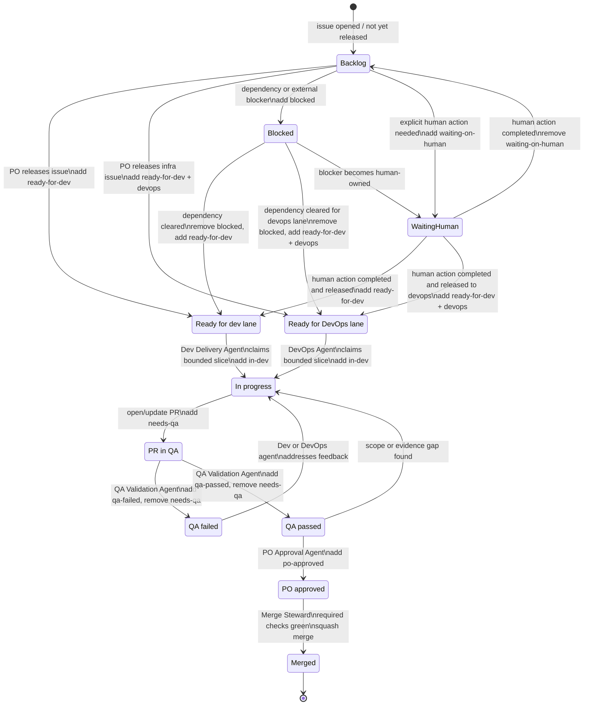
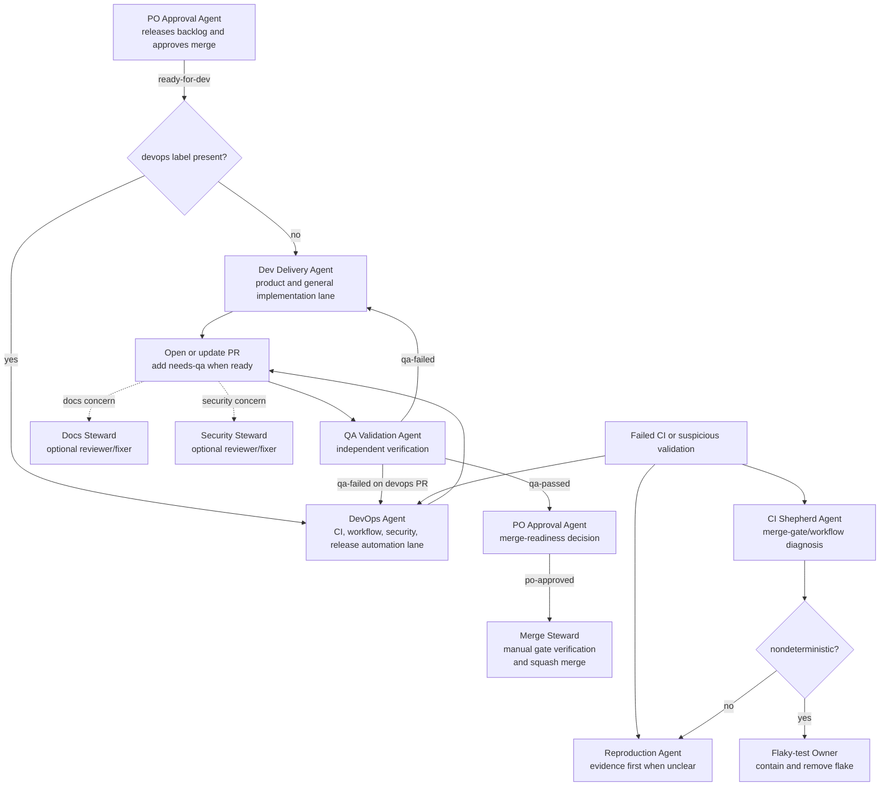

# Automation Agent Operations

## Goal

Casgrain is intentionally agent-native for repository maintenance, but agent autonomy should stay explicit and bounded.

This document defines the repo-operations responsibilities that can be delegated to automation without changing Casgrain's product behavior.

## Scope

These roles apply to repository maintenance work such as:
- issue triage
- bug reproduction and evidence gathering
- CI failure diagnosis
- flaky-test ownership
- backlog hygiene and docs reconciliation

They do not redefine Casgrain's runtime architecture or put LLMs in the deterministic execution path.

## Shared operating rules

All automation agents operating in this repository should:
- treat GitHub Issues as the backlog source of truth
- inspect open issues, PRs, recent activity, and branch state before starting work
- work one bounded slice at a time
- prefer cheap evidence before expensive exploration
- keep diffs small and focused
- open PRs rather than pushing directly to `main`
- stop when a proposed change would alter product behavior, developer experience, or architecture in a meaningful way
- record discovered follow-up work in GitHub Issues instead of leaving it implicit in chat logs or PR comments

## Workflow-state labels

Casgrain uses GitHub labels as durable workflow state.

Core execution labels:
- `ready-for-dev` — released into autonomous execution; this is a release-state label, not a routing label
- `devops` — routing label for repository infrastructure, CI, workflow, security-posture, release-automation, and settings-adjacent work
- `in-dev` — actively being implemented
- `needs-qa` — ready for independent QA validation
- `qa-failed` — QA found a blocking problem
- `qa-passed` — QA validated the scoped change
- `po-approved` — product-owner proxy approved the PR for merge when the remaining gates are green
- `blocked` — waiting on another issue, repo capability, or external dependency
- `waiting-on-human` — waiting on explicit human action outside the repo automation workflow

Stewardship labels:
- `docs-needed`, `docs-approved`, `docs-blocked`
- `security-review-needed`, `security-approved`, `security-blocked`

Routing rule:
- the general Dev Delivery Agent may only pick issues labeled `ready-for-dev` that do not have `devops`
- the DevOps Agent may only pick issues labeled both `ready-for-dev` and `devops`
- if an issue is unlabeled, it is backlog only and is not yet released into execution

Use GitHub-native relationship metadata (`Blocked by`, `blocking`, Parent/sub-issue) to express true dependencies whenever GitHub can represent them directly. Labels and comments should reflect that state clearly, not replace it.

## Human and agent boundaries

Humans remain responsible for:
- product-direction decisions
- architectural tradeoffs
- meaningful developer-experience changes
- approving high-risk changes
- repository settings changes that cannot be expressed safely in-repo

Agents may act autonomously on:
- maintenance-oriented docs reconciliation
- issue clarification and triage comments
- validation and CI hardening that does not change expected product behavior
- small regression tests for already-decided behavior
- bug reproduction and evidence capture
- PR preparation for bounded low-risk slices

Agents must escalate instead of proceeding when:
- requirements are ambiguous
- multiple reasonable next steps would change project direction
- the safest next move depends on human prioritization
- a change crosses a product, DX, or architecture boundary
- the evidence is too weak to justify a code or policy change

## Role definitions

### 1. Backlog hygiene agent

Purpose:
- keep issues, plans, and docs aligned
- prevent stale maintenance work from quietly drifting

Typical triggers:
- scheduled maintenance runs
- newly opened issues
- merged PRs that leave follow-up work behind
- docs that reference already-completed or missing backlog items

Expected outputs:
- issue triage comments
- labels, assignments, or closures when evidence is clear
- small docs reconciliations opened as PRs
- follow-up issues for newly discovered maintenance gaps

Must not:
- invent roadmap work that is not grounded in existing issues or repo evidence
- close active work that still has unresolved product decisions

#### Backlog hygiene protocol

Before choosing work, the backlog hygiene agent should gather cheap evidence in this order:
1. inspect local branch state and the active repo operating docs (`AGENTS.md`, `docs/plans/current-plan.md`, and `docs/validation.md`)
2. inspect open GitHub Issues, open PRs, recent merged PRs, and recent `main` history
3. inspect the candidate issue body, comments, labels, and nearby files before editing anything

The non-interference screen is mandatory. Do not start a coding slice when:
- an open PR already covers the issue or same file area
- a branch name, recent comment, or fresh commit shows someone is actively working the same change
- the change would overlap very recent product-path work and is not purely reconciliatory
- the safest next step depends on a human product or DX decision

After inspection, choose exactly one outcome for the run:
1. **Coding slice** when the issue is clearly bounded, maintenance-oriented, and safe to complete in one PR
2. **Triage-only update** when the right next step is clarification, labeling, assignment, or a comment with findings and a concrete proposal
3. **No-op** when interference risk, insufficient evidence, or settings-side blockers make even a small in-repo change unsafe

When a coding slice is safe, keep it narrow:
- change only the files needed for the selected issue
- prefer docs reconciliation, validation hardening, or small regression coverage over broader refactors
- convert any newly discovered adjacent work into follow-up GitHub Issues instead of expanding the PR

When triaging issues, the backlog hygiene agent may:
- add or remove labels when the classification is evidence-backed
- close issues only when the work is already landed, duplicated, or explicitly not planned
- leave a comment summarizing what was checked, why the chosen action is safe, and what should happen next

Every maintenance-loop completion report should include:
- which issue was selected and why it was safe
- whether the result was a coding slice, triage-only update, or no-op
- what evidence or repo state was inspected
- what validation ran, if any
- any PR or follow-up issue links
- any explicit blocker that prevented further safe progress

Escalate instead of proceeding when:
- the issue would change product behavior or developer experience in a meaningful way
- multiple reasonable issue choices exist but require human prioritization
- the repo needs settings-side enforcement rather than an in-repo change
- the evidence is too weak to justify labels, closure, or code edits

### 2. Reproduction agent

Purpose:
- turn bug reports or suspicious failures into deterministic evidence
- produce reproduction evidence that meets the repo's canonical contract in `docs/development/bug-reproduction-evidence-contract.md`

Typical triggers:
- issues with incomplete reproduction detail
- CI failures that are not obviously infrastructure-only
- reports of runtime regressions, trace gaps, or fixture inconsistencies

Expected outputs:
- minimal reproduction steps
- captured commands, traces, logs, screenshots, or artifacts
- issue comments clarifying whether the problem is deterministic, flaky, or environment-specific
- narrowly scoped regression tests or fixture updates when the fix is already well understood and low risk

Must not:
- guess at root cause without captured evidence
- broaden a bug report into speculative product redesign

### 3. CI shepherd agent

Purpose:
- keep the validation gate trustworthy and understandable

Typical triggers:
- failed GitHub Actions runs
- missing or drifting validation docs
- workflow/tooling regressions that weaken the merge gate

Expected outputs:
- failure diagnosis with concrete run/job evidence
- small CI or docs hardening PRs
- follow-up issues for settings-side or plan-limited blockers
- issue or PR comments explaining what is blocked in-repo versus out-of-repo

Must not:
- merge around failing or still-running required checks
- weaken validation merely to make CI green

#### CI shepherd operating procedure

When a required workflow fails or behaves suspiciously, the CI shepherd agent should work in this order:
1. identify the exact failing run, workflow, branch, job, and step before proposing any change
2. compare the failure against `docs/validation.md` and `docs/development/merge-and-validation-policy.md`
3. classify the problem as one of:
   - **deterministic product or code regression**
   - **workflow/tooling drift**
   - **suspected nondeterminism**
   - **settings-side or plan-limited blocker**
4. choose the narrowest safe response and record the evidence in the issue or PR

Evidence minimum for CI diagnosis:
- workflow run URL or run ID
- failing job and step names
- the first concrete failing error, not just the top-level red status
- whether the same command fails locally or is isolated to CI infrastructure
- whether the failure affects the canonical required-check set

Response rules by classification:

**Deterministic product or code regression**
- treat the failure as a normal bug
- prefer a bounded code or test fix PR tied to the underlying issue
- involve the reproduction agent first if the failure mechanism is not yet clear
- do not add retries or workflow exceptions before understanding the product-facing defect

**Workflow or tooling drift**
- fix the workflow, tool installation, cache, checksum, documentation, or reporting gap directly
- keep the PR limited to restoring the documented validation contract
- document why the change increases trust in the gate instead of reducing coverage

**Suspected nondeterminism**
- do not classify a failure as flaky on a single weak signal
- hand off to the flaky-test owner procedure below once repeated evidence suggests the same workflow or test sometimes passes and sometimes fails without a code change that explains it

**Settings-side or plan-limited blocker**
- open or update a GitHub issue when the safe fix requires repository settings, billing/plan changes, unavailable runners, or wider policy decisions
- leave the in-repo procedural mitigation explicit while the blocker remains unresolved
- report the blocker as out-of-repo rather than pretending a docs-only change fully enforces it

Acceptable hardening actions:
- tighten workflow documentation so the required gate is explicit
- improve logging, artifact capture, and error surfacing
- verify downloaded tool integrity and pin versions/checksums
- make setup steps more deterministic
- scope targeted retries only to known infrastructure boundaries after the failure has been classified as nondeterministic

Unacceptable hardening actions:
- removing or skipping required checks just to clear the queue
- converting deterministic failures into soft warnings
- merging while required checks are still `in_progress`
- adding broad whole-job retries with no evidence that infrastructure instability is the cause
- hiding a recurring failure without opening a follow-up issue that preserves accountability

Escalate instead of editing code or workflows when:
- the likely fix would meaningfully change developer experience or the required validation contract
- the repo needs branch protection or other settings that cannot be changed in-tree
- the failure points to product-direction ambiguity rather than maintenance drift

### 4. DevOps agent

Purpose:
- operate repository infrastructure and delivery plumbing that support Casgrain without changing product behavior
- keep public-repo hardening, CI security posture, and release automation explicit and reviewable

Typical triggers:
- GitHub Actions workflow changes
- branch protection or repository settings reviews
- CodeQL, Dependabot, Renovate, or secret-scanning setup
- SHA pinning, permission tightening, or checkout hardening
- release automation, Docker publishing, or other delivery pipeline adjustments

Expected outputs:
- small PRs for workflow or docs changes
- validation evidence for security or CI hardening changes
- concrete follow-up issues for settings-side blockers or missing platform capabilities
- clear notes about what is enforced in-repo versus what still depends on GitHub settings

Must not:
- change product behavior or developer experience without explicit human review
- widen scope from infrastructure hardening into product architecture
- assume a settings-side control exists when the repo cannot actually enforce it

#### DevOps agent operating procedure

When a request is about repo infrastructure, the DevOps agent should work in this order:
1. inspect the current repo state, active workflows, branch protection, repo security settings, and recent CI runs
2. determine whether the change is a workflow edit, a GitHub settings change, or a blocker that requires a follow-up issue
3. implement the narrowest safe slice that restores or improves the delivery/security contract
4. validate the result and record the remaining risk or dependency explicitly

Escalate instead of proceeding when:
- the change would alter product behavior, CLI ergonomics, or runtime architecture
- the safest fix depends on GitHub settings or billing/plan changes that cannot be expressed in-repo
- the rollout would leave the default branch or public contribution path in a worse state than before

### 5. Flaky-test owner agent

Purpose:
- identify, isolate, and reduce nondeterminism in validation

Typical triggers:
- intermittently failing tests or workflows
- reports that a failure cannot be reproduced consistently
- simulator/emulator instability that blurs product failures and infrastructure failures

Expected outputs:
- evidence describing the flake signature
- issue updates that separate deterministic bugs from nondeterministic infrastructure noise
- hardening PRs that improve selection, waiting, retries, observability, or fixture isolation
- explicit follow-up issues when a flake cannot be safely fixed in one slice

Must not:
- hide real failures behind broad retries
- mute tests without replacing lost signal intentionally and explicitly

#### Flaky-test owner operating procedure

A failure should only be treated as flaky after evidence shows nondeterminism instead of a deterministic defect.

Minimum evidence before labeling something as flaky:
- at least two materially similar failures with comparable symptoms
- at least one successful run or reproduction path for the same code state, or equivalent evidence that the failure is intermittent rather than universal
- the failing boundary is identified clearly enough to say whether the instability is in tests, workflow setup, simulator/emulator infrastructure, or an external dependency

Classification questions:
1. does the same command fail locally in a stable way?
2. does the same revision alternate between pass and fail?
3. does the error point to timing, resource contention, environment bootstrapping, or missing observability rather than an assertion mismatch?
4. would a retry preserve signal, or would it only hide an unresolved defect?

Acceptable flake mitigations when the evidence supports them:
- targeted waits or readiness checks at unstable environment boundaries
- narrower retries around idempotent infrastructure steps such as downloads or simulator boot waits
- improved artifact capture, timestamps, screenshots, traces, or logs so future failures are diagnosable
- fixture isolation or cleanup that removes state leakage between runs
- quarantining a test only when the lost coverage is explicitly acknowledged and tracked in GitHub

Unacceptable flake mitigations:
- blind rerun-until-green loops
- suite-wide retries that make deterministic regressions harder to detect
- deleting or disabling tests without a replacement signal or tracked follow-up
- calling a failure flaky merely because it is expensive or inconvenient to debug

When quarantine is the least-bad option, the flaky-test owner must:
1. open or update a GitHub issue describing the flake signature and missing signal
2. explain why narrower hardening could not be completed safely in the current slice
3. preserve as much validation signal as possible elsewhere
4. propose the next bounded step required to remove the quarantine

The flaky-test owner should hand work back to the CI shepherd agent when the primary fix is workflow hardening, and back to the reproduction or product fix path when the evidence points to a deterministic defect.

## Coordination model

When multiple roles could respond to the same situation, prefer this order:
1. backlog hygiene agent confirms the work is safe and not already in progress
2. reproduction agent gathers evidence if the failure or bug is unclear
3. DevOps agent handles repo infrastructure, security posture, workflow, or settings work
4. CI shepherd agent tightens validation or workflow behavior when the failure is in the merge gate
5. flaky-test owner agent handles confirmed nondeterminism separately from deterministic defects

This ordering keeps repo maintenance grounded in evidence rather than jumping directly to fixes.

## Workflow diagrams

### Issue and PR state machine

### Agent responsibilities and handoff points

## Governance status

This document now defines the bounded operating procedures for the backlog hygiene, reproduction, CI shepherd, DevOps, and flaky-test owner roles. Any further rollout work should be tracked as concrete GitHub Issues rather than assumed implicitly from these role definitions.

Related completed follow-up work:
- issue #43 — deterministic bug reproduction evidence contract in `docs/development/bug-reproduction-evidence-contract.md`
- issue #44 — CI shepherd and flaky-test owner operating procedures in this document

## Relationship to other repo documents

- `CONTRIBUTING.md` defines the contributor-facing bug filing expectations
- `docs/development/bug-reproduction-evidence-contract.md` defines the canonical evidence package for reproduction claims
- `AGENTS.md` defines the high-level operating contract for repo work
- `docs/validation.md` defines the canonical validation gate
- `docs/development/merge-and-validation-policy.md` defines merge classes and merge discipline
- `docs/plans/current-plan.md` remains the live project direction document
